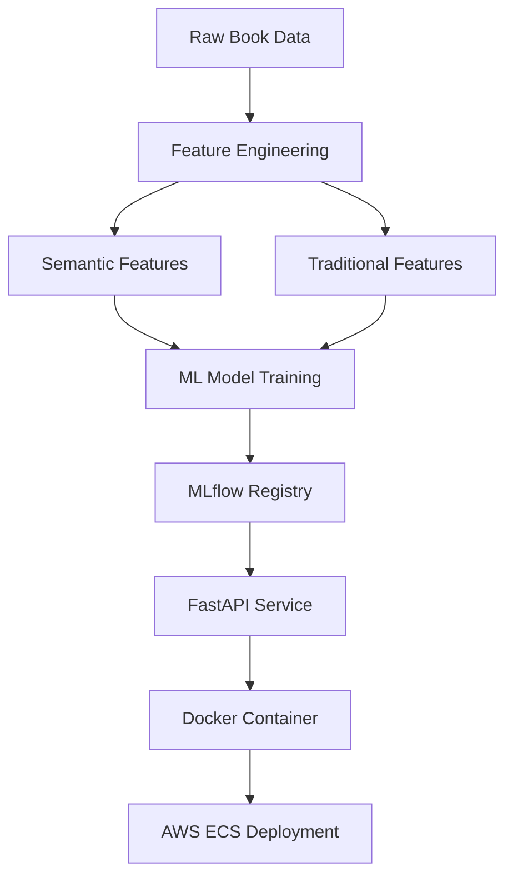

# 📚 Children's Books Rating Prediction

A machine learning system that predicts book ratings using semantic content analysis and traditional features, achieving 46.8% improvement over baseline models.

[](https://www.docker.com/)
[](https://mlflow.org/)
[](https://fastapi.tiangolo.com/)
[](https://www.python.org/)

## 🎯 Problem Statement

**Business Challenge**: Parents and educators struggle to find high-quality, age-appropriate children's books due to sparse and inconsistent rating systems in children's literature.

**Technical Solution**: Build an ML pipeline that predicts book ratings using:
- Semantic content analysis of titles and descriptions
- Traditional metadata features (pages, publication year, etc.)
- Advanced similarity-based features

**Impact**: 
- 🏠 Help parents discover quality books for their children
- 📚 Assist educators in curriculum planning and book selection
- 📊 Support publishers in understanding market preferences

## 🏆 Model Performance

| Metric | Value | Improvement |
|--------|-------|-------------|
| **R² Score** | **0.2830** | **+46.8%** vs baseline |
| **RMSE** | 0.2871 | Low prediction error |
| **MAE** | 0.234 | Mean absolute error |
| **Features** | 511 total | Semantic + traditional |

### 🔍 Key Discovery
> **Books with similar content, themes, and narrative styles receive similar ratings.**

The most predictive feature is `mean_similar_rating` (11.8% importance) - the average rating of books with semantically similar content.

## 📊 Top Predictive Features

| Rank | Feature | Importance | Type | Description |
|------|---------|------------|------|-------------|
| 🥇 | `mean_similar_rating` | 11.8% | Semantic | Average rating of content-similar books |
| 🥈 | `median_similar_rating` | 6.5% | Semantic | Median rating of similar books |
| 🥉 | `review_ratio` | 1.6% | Traditional | Reviews to ratings ratio |
| 4 | `is_picture_book` | 1.3% | Traditional | Picture book indicator |
| 5 | `weighted_similar_rating_k10` | 1.2% | Semantic | Weighted average (k=10 neighbors) |

**💡 Insight**: Semantic features dominate with **83%** of total model importance.

## 🏗️ Architecture



### Project Structure
```
├── src/
│   ├── data/           # ETL and data processing
│   ├── features/       # Feature engineering pipelines
│   ├── models/         # Training, evaluation, and inference
│   └── api/           # FastAPI deployment endpoints
├── tests/
│   ├── unit/          # Unit tests
│   └── integration/   # Integration tests
├── configs/           # Model and training configurations
├── notebooks/         # EDA and analysis
├── deployment/        # Docker and IaC
└── iac/              # Terraform infrastructure
```

## 🚀 Quick Start

### Prerequisites
- Python 3.11+
- Docker
- Make

### 1. Setup Environment
```bash
# Clone repository and setup
git clone <repository-url>
cd review-rating-prediction

# Install dependencies and setup virtual environment
make setup
```

### 2. Train Model
```bash
# Train the optimized semantic model
make train-best

# Register model in MLflow
make register-model

# View experiments
make mlflow-ui
```

### 3. Run API Locally
```bash
# Build and run Docker container
make docker-build
make docker-run

# Test API health
curl http://localhost:8000/health
```

### 4. Test Predictions
```bash
# Predict book rating
curl -X POST "http://localhost:8000/predict" \
     -H "Content-Type: application/json" \
     -d '{
       "title": "The Very Hungry Caterpillar",
       "description": "A beautiful picture book about a caterpillar who eats through various foods before transforming into a butterfly",
       "authors": "Eric Carle",
       "publication_year": 1969,
       "num_pages": 32
     }'

# Expected response:
# {"predicted_rating": 4.2, "book_info": {...}, "features_shape": [1, 103]}
```

## 🛠️ Technical Details

### Feature Engineering Pipeline
- **Semantic Features**: TF-IDF vectorization + SVD dimensionality reduction
- **Similarity Features**: Content-based similarity using cosine distance
- **Traditional Features**: Pages, publication year, author metrics
- **LLM Features**: Advanced content quality scoring

### Model Architecture
- **Algorithm**: Random Forest Regressor (optimized)
- **Features**: 103 engineered features
- **Validation**: Time-based split with cross-validation
- **Tracking**: MLflow for experiment management

### API Endpoints
- `GET /health` - Health check and model status
- `POST /predict` - Single book rating prediction
- `POST /batch-predict` - Multiple book predictions (planned)
- `GET /model-info` - Model metadata and performance

## 📈 Development Workflow

### Available Make Commands
```bash
make setup           # Setup development environment
make train-best      # Train optimized model
make register-model  # Register model in MLflow
make register-model  # Register model in MLflow
make prefect-train   # Orchestrates MLFlow Pipeline
make test           # Run all tests
make lint           # Code linting and formatting
make docker-build   # Build Docker image
make docker-run     # Run containerized API
make clean          # Clean artifacts and cache
```

### Reproducibility
- All dependencies pinned in `pyproject.toml`
- Python version locked to 3.11
- Deterministic model training with fixed seeds
- MLflow experiment tracking for full reproducibility

## 🚢 Deployment

### Local Development
```bash
# API available at http://localhost:8000
make docker-run
```

### Production Deployment (Planned)
- **Infrastructure**: AWS ECS with Terraform
- **CI/CD**: GitHub Actions with semantic release
- **Monitoring**: CloudWatch + Prometheus metrics
- **Scaling**: Auto-scaling based on request volume

## 📊 Model Monitoring

### Performance Tracking
- Model drift detection
- Prediction quality metrics
- Feature importance monitoring
- A/B testing framework (planned)

### Logging and Observability
- Structured logging with correlation IDs
- Request/response tracking
- Error monitoring and alerting
- Performance metrics dashboard

## 🧪 Testing

```bash
# Run all tests
make test

# Run specific test suites
make test-unit        # Unit tests
make test-integration # Integration tests

# Test API endpoints
make test-api        # API functionality tests
```

## 📝 Contributing

1. Fork the repository
2. Create a feature branch: `git checkout -b feature/amazing-feature`
3. Commit changes: `git commit -m 'Add amazing feature'`
4. Push to branch: `git push origin feature/amazing-feature`
5. Open a Pull Request

## 📜 License

This project is licensed under the MIT License - see the [LICENSE](LICENSE) file for details.

## 🤝 Support

- 📧 **Email**: [your-email@domain.com]
- 📖 **Documentation**: [Link to detailed docs]
- 🐛 **Issues**: [GitHub Issues](https://github.com/your-repo/issues)
- 💬 **Discussions**: [GitHub Discussions](https://github.com/your-repo/discussions)

---

**Built with ❤️ for better children's book discovery**